<div align="center">
<!-- ### A modern, role-based healthcare ecosystem built with the MERN stack. -->

# 🩺 PulseFlow

PulseFlow is an end-to-end platform that seamlessly synchronizes workflows between **Patients**, **Doctors**, and **Administrators**—handling everything from intelligent appointment scheduling and clinical documentation to analytics, billing, and Stripe-powered payments.

<p align="center">

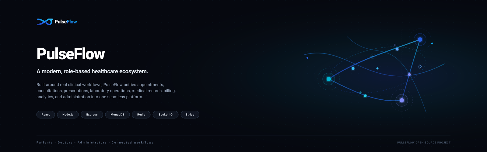

</p>

<p align="center">


</p>

<p align="center">

<a href="#">🌐 Live Demo</a> •
<a href="./docs/ARCHITECTURE.md">🏗 Architecture</a> •
<a href="./docs/API.md">📚 API</a> •
<a href="./docs/FLOWS.md">🔄 Workflows</a>

</p>

</div>

---

# 📖 Overview

PulseFlow is designed around **real-world healthcare workflows**, not isolated CRUD operations.

Instead of treating appointments, medical records, prescriptions, laboratory reports, invoices, and payments as independent modules, the platform models how clinical information naturally flows throughout a healthcare ecosystem.

A consultation can evolve from a scheduled appointment into a complete treatment lifecycle—producing medical records, prescriptions, laboratory reports, invoices, payment sessions, audit logs, analytics, and administrative insights while maintaining strict role-based authorization across every interaction.

---

# 📸 Product Preview

> Replace the placeholders below with screenshots or GIFs before publishing.

## Landing Page

<!--  -->

---

## 👤 Role Aware Dashboards

<!-- <table>
  <tr>
    <td colspan="2" align="center">
      <strong>Patient Dashboard</strong>
    </td>
  </tr>
  <tr>
    <td>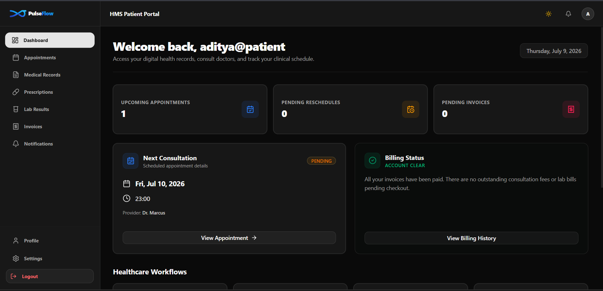</td>
    <td>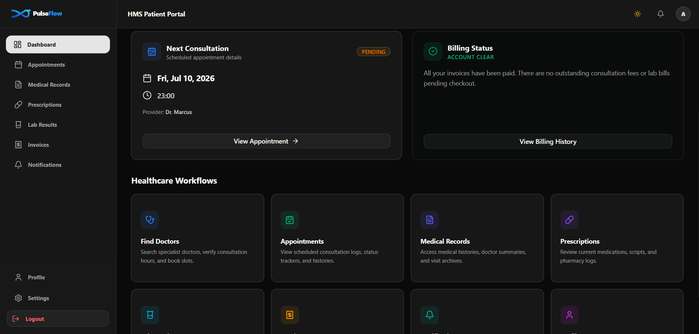</td>
  </tr>
  <tr>
    <td colspan="2" align="center">
      <strong>Doctor Dashboard</strong>
    </td>
  </tr>
  <tr>
    <td>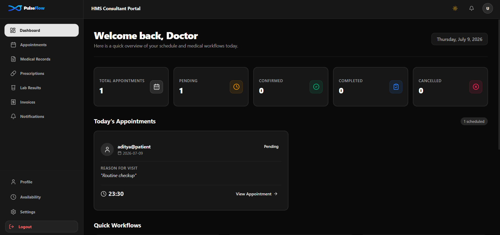</td>
    <td>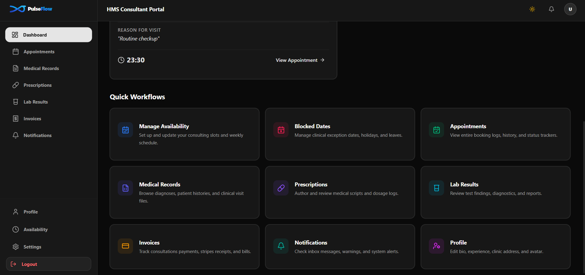</td>
  </tr>
  <tr>
    <td colspan="2" align="center">
      <strong>Admin Dashboard</strong>
    </td>
  </tr>
  <tr>
    <td>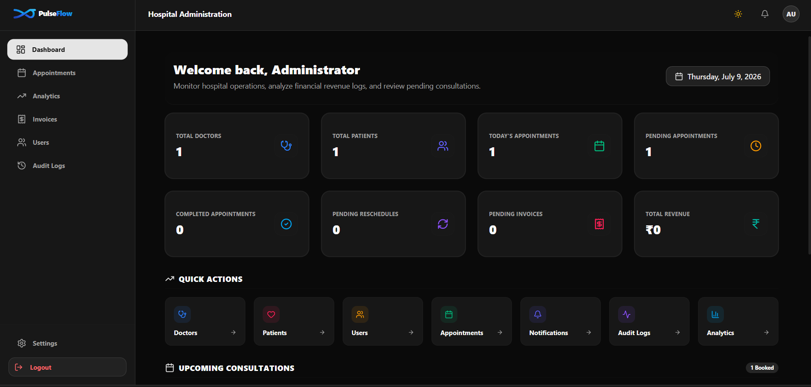</td>
    <td>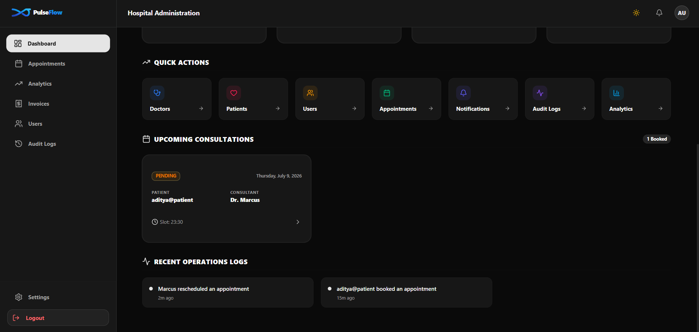</td>
  </tr>
</table> -->

<table>
  <tr>
    <td align="center"><strong>Patient Dashboard</strong></td>
    <td align="center"><strong>Doctor Dashboard</strong></td>
    <td align="center"><strong>Admin Dashboard</strong></td>
  </tr>
  <tr>
    <td></td>
    <td></td>
    <td></td>
  </tr>
</table>

---

## 🩺 Consultation Workspace

<table>
  <tr>
    <td align="center"><strong>Appointment</strong></td>
    <td align="center"><strong>Reschedule Window</strong></td>
    <td align="center"><strong>Prescriptions(medical module)</strong></td>
  </tr>
  <tr>
    <td>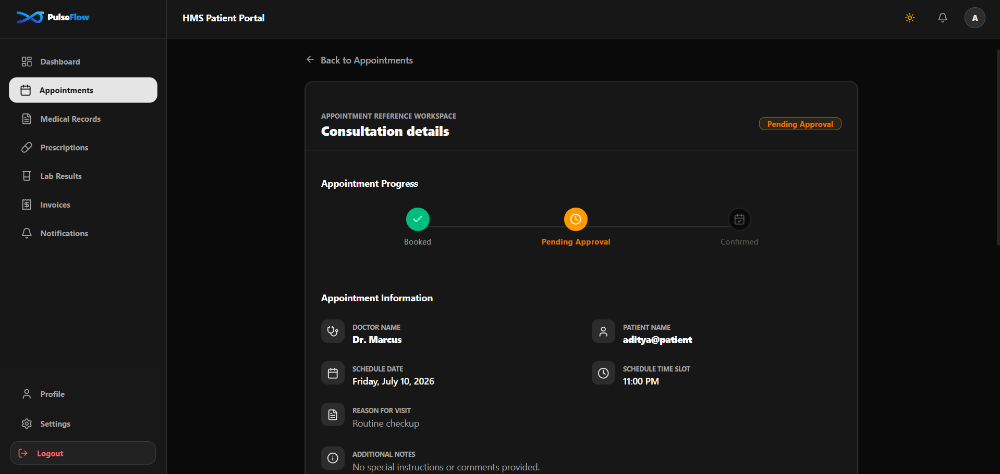</td>
    <td>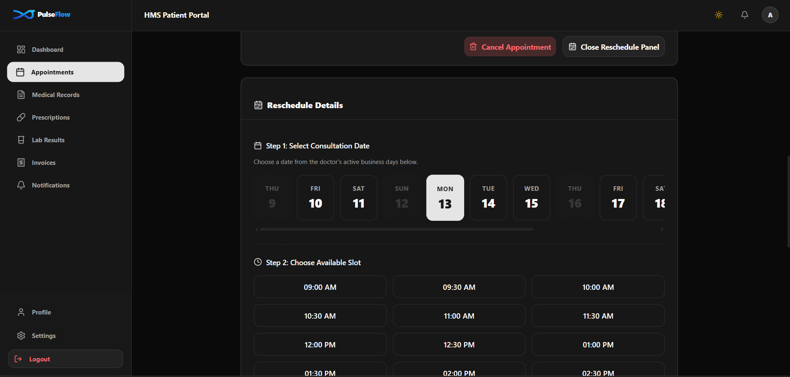</td>
    <td>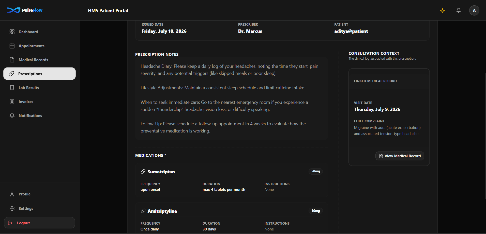</td>
  </tr>
</table>

---

## 📊 Analytics and Audit Logs

<table>
  <tr>
    <td colspan="3" align="center">
      <strong>Analytics</strong>
    </td>
        <td colspan="1" align="center">
      <strong>Audit Logs</strong>
    </td>
  </tr>
  <tr>
    <td>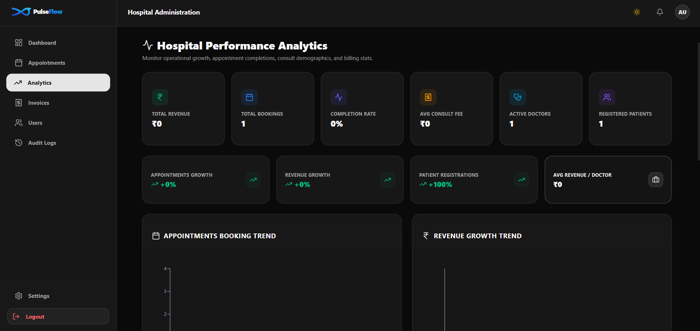</td>
    <td>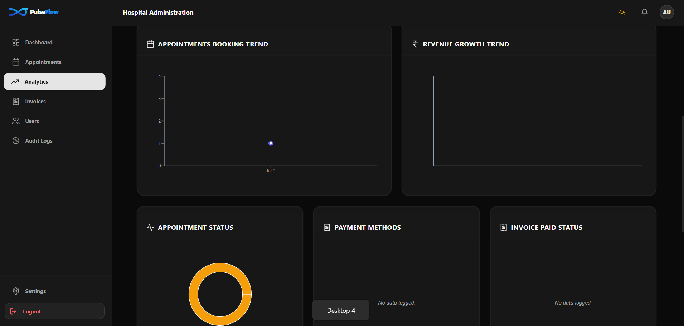</td>
    <td>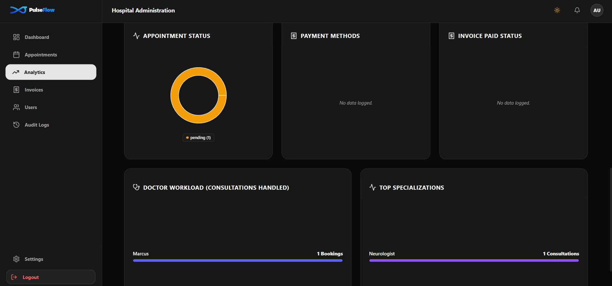</td>
    <td>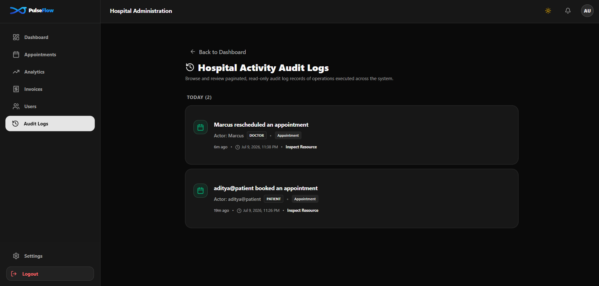</td>
  </tr>
</table>

---

# ✨ Core Modules

| 👤 Patient Experience | 👨‍⚕️ Doctor Workspace | 👨‍💼 Administration |
|----------------------|----------------------|--------------------|
| Appointment Booking | Consultation Workspace | Dashboard |
| Appointment History | Medical Records | User Management |
| Medical Records | Prescriptions | Appointment Oversight |
| Prescriptions | Laboratory Results | Medical Records |
| Laboratory Reports | Invoice Generation | Prescriptions |
| Invoice History | Appointment Management | Laboratory Results |
| Stripe Payments | Profile Management | Invoice Management |
| Profile Management | Availability Management | Analytics |

---

# 🔄 Clinical Workflow

> Replace this diagram with an SVG later.

```text
                        CONSULTATION LIFECYCLE
                               
                                Patient
                                   │
                                   ▼
                         ┌───────────────────┐
                         │ Book Appointment  │
                         └───────────────────┘
                                   │
                                   ▼
                         ┌───────────────────┐
                         │   Consultation    │
                         └───────────────────┘
                                   │
                                   ▼
                         ┌───────────────────┐
                         │  Medical Record   │
                         └───────────────────┘
                                   │
                       ┌───────────┴───────────┐
                       ▼                       ▼
             ┌───────────────────┐   ┌───────────────────┐
             │   Prescription    │   │    Lab Result     │
             └───────────────────┘   └───────────────────┘
                       │                       │
                       └───────────┬───────────┘
                                   ▼
                         ┌───────────────────┐
                         │      Invoice      │
                         └───────────────────┘
                                   │
                                   ▼
                         ┌───────────────────┐
                         │      Stripe       │
                         └───────────────────┘
                                   │
                                   ▼
                         ┌───────────────────┐
                         │    Audit Logs     │
                         └───────────────────┘
```

---

# 🏗 System Architecture

> Replace this diagram with architecture.svg later.

```text
                         React Application
                                │
         ┌──────────────────────┼──────────────────────┐
         ▼                      ▼                      ▼
   Patient Portal         Admin Portal          Doctor Portal
         │                      │                      │
         └──────────────────────┼──────────────────────┘
                                │
                           React Router
                                │
                          TanStack Query
                                │
                         Axios API Layer
                                │
                        Express REST API
                                │
                    Authentication Middleware
                                │
                               RBAC
                                |
                           Controllers
                                │
                            Services
                                │
                     MongoDB Atlas Database
                            │       │
                            ▼       ▼
                        Cloudinary  Stripe API
```

---

# 🚀 Technology Stack

### Frontend

- React
- React Router
- TanStack Query
- React Hook Form
- Zod
- Tailwind CSS
- shadcn/ui
- Axios

### Backend

- Node.js
- Express.js
- MongoDB Atlas
- Mongoose
- JWT Authentication
- Bcrypt

### External Services

- Stripe Checkout
- Socket.io
- Redis
- Cloudinary

### Deployment

- Vercel
- Render

---

# 📚 Documentation

### 🏗 Architecture

Application architecture, request lifecycle, authentication, module organization, and deployment.

→ **docs/ARCHITECTURE.md**

---

### 🗄 Database

Collections, relationships, aggregation design, and indexing strategy.

→ **docs/DATABASE.md**

---

### 📖 API Reference

Complete backend API documentation organized by module.

→ **docs/API.md**

→ **docs/APIcontracts.md**

---

### 🔄 Business Workflows

Authentication, appointments, consultations, prescriptions, laboratory reports, invoicing, payments, and administration.

→ **docs/FLOWS.md**

---

### 📈 Scaling Roadmap

Current architecture, future enhancements, scalability considerations, and planned engineering improvements.

→ **docs/SCALING.md**

---

# ⚙️ Getting Started

## Clone Repository

```bash
git clone https://github.com/forest-whispers/PulseFlow.git
```

```bash
cd PulseFlow
```

---

## Install Dependencies

### Backend

```bash
cd server
npm install
```

### Frontend

```bash
cd client
npm install
```

---

## Environment Variables

### Backend

```env
PORT=

MONGO_URI=

JWT_SECRET=

CLIENT_URL=

CLOUDINARY_CLOUD_NAME=
CLOUDINARY_API_KEY=
CLOUDINARY_API_SECRET=

STRIPE_SECRET_KEY=
STRIPE_WEBHOOK_SECRET=
```

### Frontend

```env
VITE_API_URL=

VITE_STRIPE_PUBLISHABLE_KEY=
```

---

## Run Development Server

Backend

```bash
npm run dev
```

Frontend

```bash
npm run dev
```

---

# 🌍 Deployment

| Service | Platform |
|----------|----------|
| Frontend | Vercel |
| Backend | Render |
| Database | MongoDB Atlas |
| Media Storage | Cloudinary |
| Payments | Stripe |

---

# 🛣 Roadmap

Future enhancements planned for PulseFlow include:

- Global Search Infrastructure
- Advanced Filtering & Sorting
- Background Job Processing
- Notification Center
- Real-time Updates
- Redis Caching
- Monitoring & Reporting
- Enhanced Analytics

---

# 📜 License

This project is licensed under the MIT License.

---

<div align="center">

**PulseFlow** was built as an engineering-focused portfolio project to explore scalable backend architecture, role-based application design, healthcare workflows, analytics, payment integration, and modern full-stack development using the MERN ecosystem.

</div>